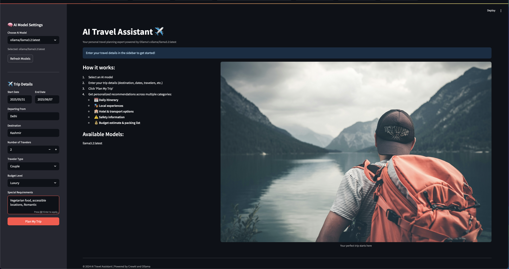
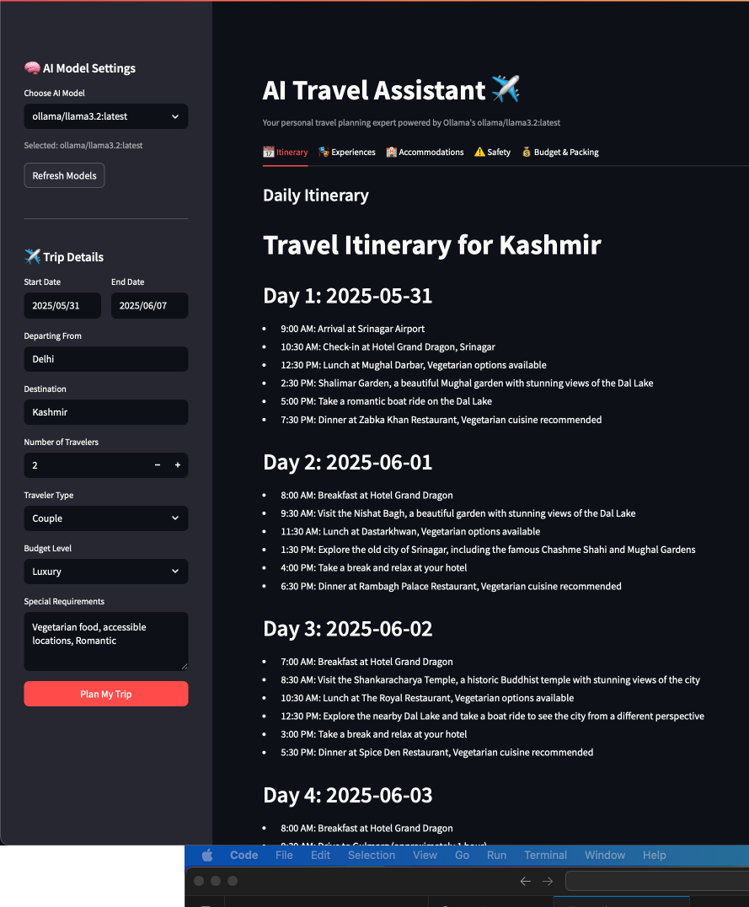
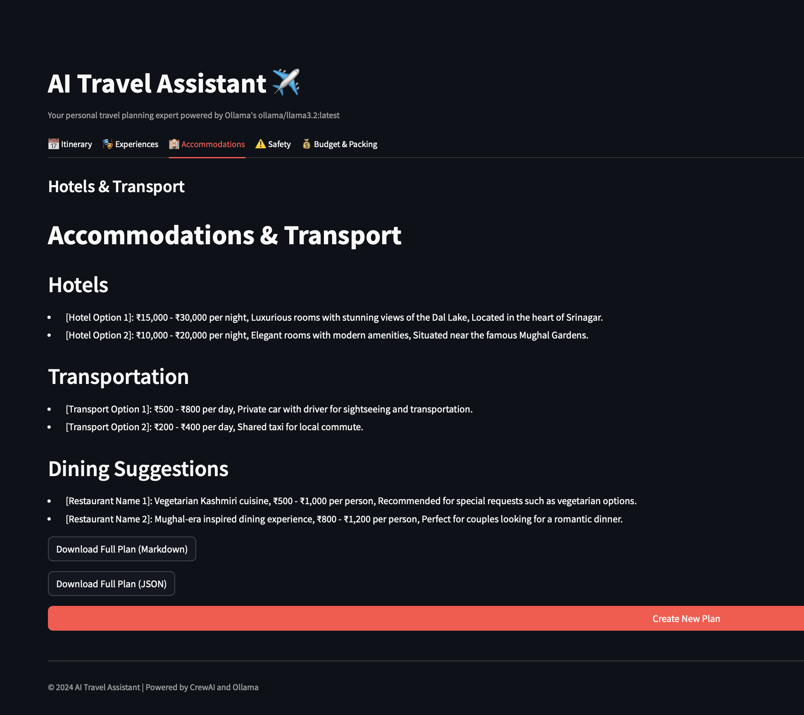
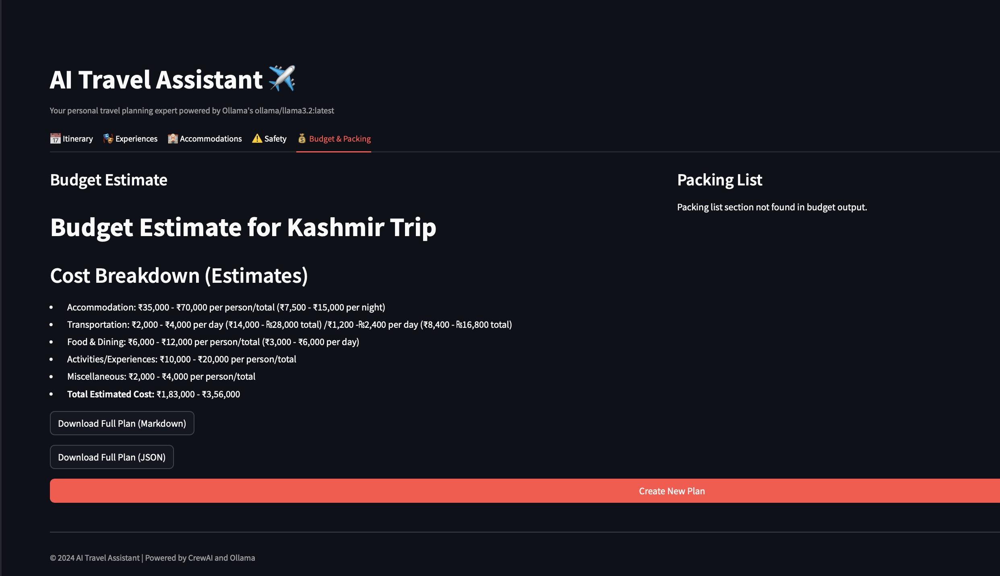
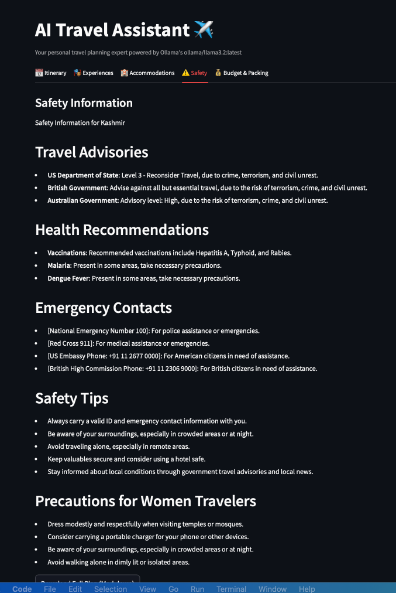
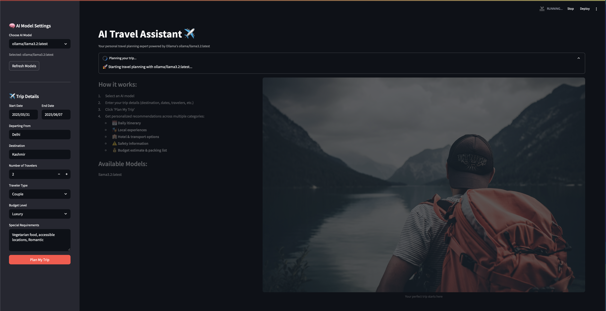

# ✈️ AI Travel Assistant

**Your personal AI-powered travel planning expert!**  
This Streamlit application leverages the power of **CrewAI** and **Ollama** to generate personalized travel itineraries, recommend local experiences, suggest accommodations, provide safety information, and estimate budgets for your trips.

---

## ✨ Features

- **Personalized Itineraries**: Generates daily travel plans based on your destination, dates, and traveler profile.
- **Local Experiences**: Suggests unique cultural activities tailored to your preferences.
- **Accommodation & Transport**: Recommends hotels, transport, and dining options based on budget.
- **Safety Information**: Includes travel advisories, health tips, and emergency contacts.
- **Budget & Packing List**: Provides a cost estimate and packing checklist.
- **Ollama Integration**: Uses local LLMs for private, offline AI interactions.
- **Interactive UI**: Built with Streamlit for a clean and easy-to-use interface.
- **Downloadable Plans**: Export your travel plan in Markdown or JSON formats.

---

## 🚀 Technologies Used

- **Python**: Core language.
- **Streamlit**: Web interface.
- **CrewAI**: AI agent orchestration.
- **Ollama**: Local LLM runtime.
- **Requests**: For API communication.
- **datetime**: For travel date calculations.

---

## ⚙️ Setup Instructions

### Prerequisites

- **Python 3.9+**
- **Ollama**

### Install Ollama

1. Download Ollama from [https://ollama.com](https://ollama.com)
2. In your terminal:

   ```bash
   ollama run llama3.2
   ```

   This downloads and runs the model. You can stop it — the app will start it when needed.

---

### 🔧 Installation

```bash
# Clone the repository
git clone https://github.com/chandanbcsm012/AI-Travel-Assistant.git
cd AI-Travel-Assistant

# Create virtual environment
python -m venv venv

# Activate it
# macOS/Linux:
source venv/bin/activate
# Windows:
.\venv\Scripts\activate

# Install dependencies
pip install -r requirements.txt
```

Create `requirements.txt` with:

```txt
streamlit
crewai
requests
```

---

## 🏃 How to Run

1. **Ensure Ollama is running**

   ```bash
   ollama run llama3.2
   ```

2. **Start the Streamlit App**

   ```bash
   streamlit run travel_crew.py
   ```

3. **Access the app** at:  
   [http://localhost:8501](http://localhost:8501)

---

## 📝 Usage

### 🔧 Sidebar Settings

- Select available **Ollama model**
- Click **Refresh Models** after adding a new one
- Fill trip details:
  - Start/End Dates
  - Departing From / Destination
  - Traveler Count & Type
  - Budget & Special Needs

### 🧠 Plan Your Trip

- Click **Plan My Trip**
- See AI planning progress
- Tabs show:
  - 📅 Itinerary
  - 🎭 Experiences
  - 🏨 Accommodations
  - ⚠️ Safety
  - 💰 Budget & Packing

### 📥 Export & Reset

- Download your trip plan in **Markdown** or **JSON**
- Click **Create New Plan** to start over

---

## 🖼️ App Screenshots

| Home | Itinerary | Experiences |
|------|-----------|-------------|
|  |  |  |

| Accommodations | Budget & Estimate | Safety |
|----------------|-------------------|--------|
|  |  |  |

| Trip Planning |
|---------------|
|  |

---

## 📂 Project Structure

```
.
├── travel_crew.py         # Streamlit app with CrewAI logic
├── requirements.txt       # Python package dependencies
└── README.md              # Project documentation
```

---

## 💡 Future Enhancements

- 🔒 **User Authentication**
- 🗺️ **Interactive Maps**
- 🔄 **Live Flight/Hotel APIs**
- 🧠 **Feedback System**
- 🎙️ **Voice/Image input**
- 🧭 **Granular itinerary constraints**

---

## 📄 License

This project is open-sourced under the **MIT License**.

---

## 🙏 Acknowledgements

- **CrewAI** – AI agent framework  
- **Ollama** – Local LLM deployment  
- **Streamlit** – Web app framework for Python